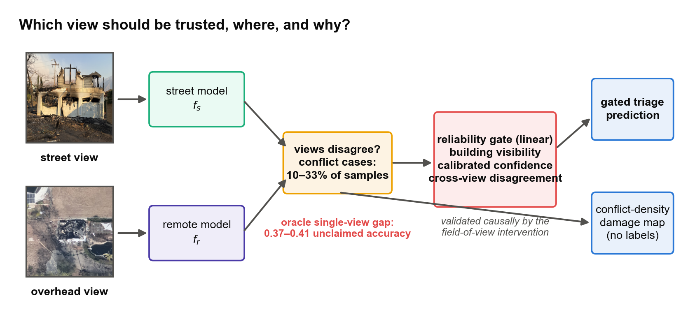
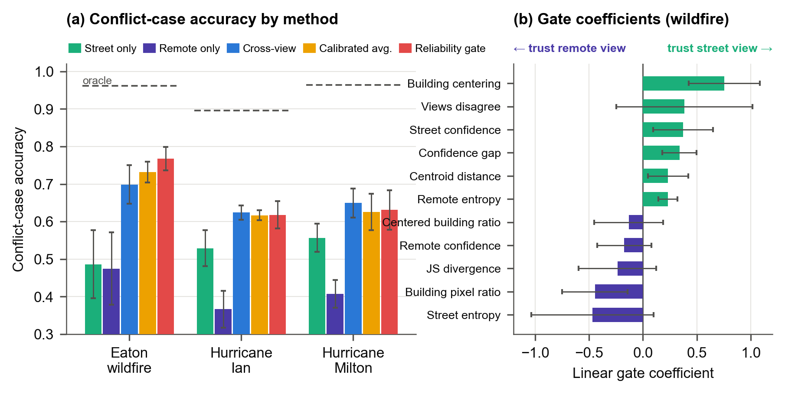
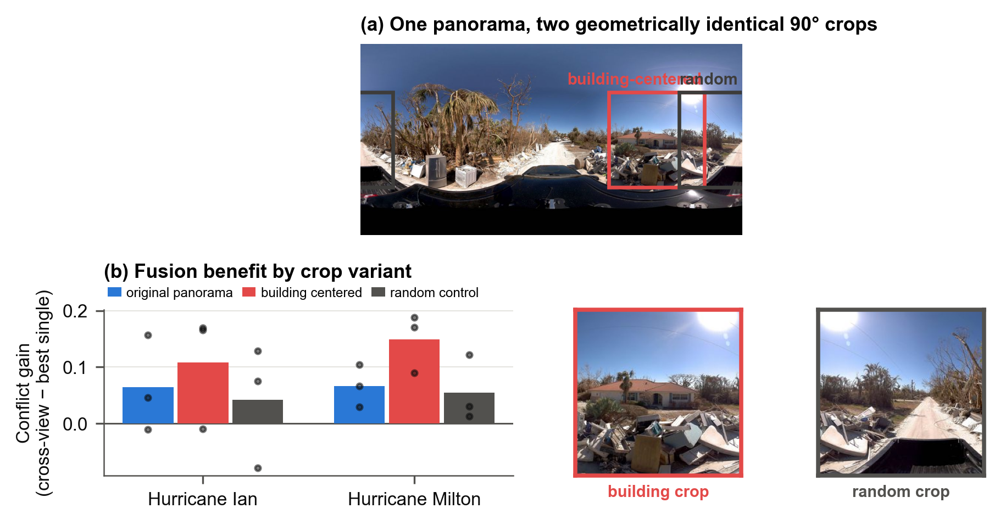
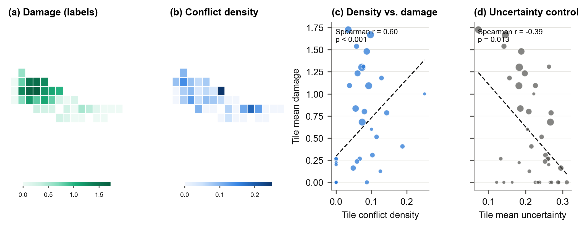
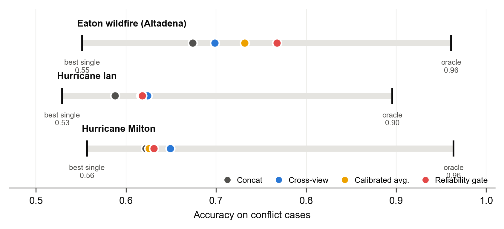

<div align="center">

# CrossViewGate

### Trust the view that sees the target

**Visibility-conditioned reliability gating for conflict-aware cross-view disaster damage assessment**

[](https://rayford295.github.io/CrossViewGate/)
[](paper/isprs_manuscript.md)
[](paper/geosearch2026_short/main.pdf)
[](https://github.com/rayford295/disaster-crossview-datasets)
[](LICENSE)




</div>

Cross-view fusion of ground-level and overhead imagery is standard practice in
post-disaster building damage assessment, and it is almost always *symmetric*:
both views are trusted equally everywhere. Measured on the cases where the two
views disagree, that assumption leaves **0.37–0.41 accuracy** on the table
across three real disasters. This repository provides the evidence, a linear
and interpretable gate that recovers a significant part of it, a controlled
intervention that shows *why*, and a label-free damage map that falls out of
the disagreement signal itself.

## At a glance

| | |
| --- | --- |
| **Question** | Not "does fusion help?" but "which view should be trusted, where, and why?" |
| **Data** | 2025 Eaton wildfire (CAL FIRE DINS inspection photos), Hurricane Ian (CVIAN panoramas), Hurricane Milton (panoramas), each paired with VHR overhead tiles |
| **Unit of analysis** | *Conflict cases*: the 10–33% of samples where independently trained street and remote models disagree |
| **Oracle single-view gap** | 0.37–0.41 conflict accuracy, stable across five seeds, calibration, and backbones |
| **Method** | A **linear** gate over 11 features: SegFormer building visibility, calibrated per-view confidence and entropy, cross-view disagreement |
| **Headline result** | Gate beats end-to-end fusion by +0.072 on wildfire conflicts and +0.018 on the full test set (p < 10⁻⁴); +0.051 over calibrated averaging (p = 0.0001); parity on panoramic data |
| **Causal test** | Building-centered 90° crops double the fusion benefit on Milton (closure 0.177 → 0.365); geometrically identical random crops do not, 6/6 |
| **Free by-product** | Tile-level conflict density predicts wildfire damage without labels (Spearman r = 0.615, p = 0.001); single-view uncertainty anti-correlates |

## Findings

1. **The oracle gap.** On conflict cases, an oracle that picks the correct
   single view beats every tested fusion method by 0.37–0.41 accuracy on all
   three disasters. Symmetric fusion leaves most view-reliability information
   unused.
2. **The reliability gate.** A linear gate mixes street, remote, and crossview
   probabilities per sample. It is the only method that significantly beats
   calibrated probability averaging, and it never significantly degrades. The
   learned rule reads: *trust the street view when it is confident and the
   building is centered in the frame.*
3. **Causal mechanism.** Street-view *target alignment*, not disaster type,
   controls the value of cross-view fusion. Capture policy is therefore itself
   an intervention: aiming cameras at structures raises the value of every
   downstream fusion component.
4. **Label-free damage mapping.** The spatial density of cross-view conflicts
   is a damage map computable within hours of acquiring paired imagery, before
   any labels exist.
5. **A negative result worth knowing.** Once single-view models are converged
   and temperature-calibrated, simple probability averaging matches or beats
   end-to-end learned fusion. The advantage of learning lies in asymmetric,
   reliability-aware arbitration, not in fusion per se.

## Results

Conflict-case accuracy on the test set (five-seed means; closure per the
oracle-gap definition in the manuscript).

| Method | Eaton wildfire | Hurricane Ian | Hurricane Milton |
| --- | :---: | :---: | :---: |
| street_only | 0.486 | 0.529 | 0.557 |
| remote_only | 0.475 | 0.367 | 0.407 |
| concat | 0.674 | 0.588 | 0.622 |
| crossview (end-to-end fusion) | 0.699 | **0.624** | **0.649** |
| calibrated probability averaging | 0.732 | 0.617 | 0.626 |
| **reliability gate (linear)** | **0.768** | 0.618 | 0.631 |
| *oracle single view* | *0.961* | *0.896* | *0.964* |
| conflict rate | 9.6% | 33.2% | 25.7% |
| gate closure of the oracle gap | **0.52** | 0.23 | 0.18 |

<table>
  <tr>
    <td width="50%"></td>
    <td width="50%"></td>
  </tr>
  <tr>
    <td><sub><b>Reliability gate.</b> (a) Conflict-case accuracy by method with the oracle as reference. (b) Linear gate coefficients on the wildfire: building centering and the confidence gap shift trust toward the street view, street entropy toward the overhead view.</sub></td>
    <td><sub><b>Causal field-of-view intervention.</b> One panorama, two 90° crops of identical geometry. Only the building-centered crop raises the cross-view conflict gain, on both hurricanes.</sub></td>
  </tr>
  <tr>
    <td></td>
    <td></td>
  </tr>
  <tr>
    <td><sub><b>Conflict density as a damage map</b> (Eaton wildfire). Labeled damage, label-free conflict density, their rank correlation, and the uncertainty control that anti-correlates with damage.</sub></td>
    <td><sub><b>The oracle gap.</b> Each bar spans from the best single view to the oracle on conflict cases; dots place each method inside the span. No method reaches the midpoint on the panoramic datasets.</sub></td>
  </tr>
</table>

Full tables, pooled paired tests, calibration decomposition, transfer matrix,
and ordinal metrics are in [`docs/results/`](docs/results/README.md). Headline
numbers come from the converged five-seed `_v2` documents; three-epoch pilot
results are kept as a low-budget ablation.

## Papers

| Version | Where | Status |
| --- | --- | --- |
| Full manuscript | [`paper/isprs_manuscript.md`](paper/isprs_manuscript.md) | ISPRS J. Photogramm. Remote Sens. target |
| Four-page short paper | [`paper/geosearch2026_short/`](paper/geosearch2026_short/) ([PDF](paper/geosearch2026_short/main.pdf)) | Submitted to GeoSearch '26, ACM SIGSPATIAL 2026 workshop |

Publication figures live in [`figures/`](figures/README.md) and are
regenerated from the result CSVs with `python scripts/build_paper_figures.py`.

## Repository map

```text
CrossViewGate/
|- crossview_conflict/   # package: data, models, training, decision/risk control, utils
|- scripts/              # pipeline and analysis scripts (see table below)
|- tests/                # protocol, provenance, and integrity tests
|- configs/              # frozen experiment contracts and ontologies
|- paper/                # manuscripts and bibliography
|- figures/              # publication figure set (fig0-fig6)
|- docs/
|  |- results/           # result documents (_v2 = headline protocol)
|  |- protocols/         # frozen experimental protocols
|  |- datasets.md        # data sources and split provenance
|  `- index.html         # project website (GitHub Pages)
|- data/features/        # AlphaEarth embeddings used for external validation
`- outputs/experiments/  # tracked external-validation outputs
```

Key scripts, in pipeline order:

| Stage | Script |
| --- | --- |
| Build splits (grouped, anti-leakage) | `make_group_splits.py`, `build_*_manifests.py`, `check_split_leakage.py` |
| Train / evaluate base models | `train_triage.py`, `eval_triage.py`, `run_multiseed_v2.sh` |
| Visibility features | `extract_visibility_features.py` |
| Calibration decomposition | `analyze_calibration_fusion.py` |
| Reliability gate (+ transfer) | `train_reliability_gate.py` |
| Causal FOV intervention | `build_fov_intervention.py`, `run_fov_intervention.sh`, `analyze_fov_intervention.py` |
| Conflict-density maps | `analyze_conflict_density_maps.py` |
| Statistics | `analyze_pooled_seed_tests.py`, `analyze_ordinal_metrics.py` |
| Figures and manuscript | `build_paper_figures.py`, `build_manuscript_docx.py` |
| Active next-view benchmarks (development) | `build_cvian_active_view_manifests.py`, `run_cvian_active_view_experiment.py`, `build_cvian_sequence_four_role_manifests.py`, `run_cvian_sequence_utility_experiment.py`, `run_milton_zero_shot_active_view_sensitivity.py` and their `verify_*` counterparts |
| Disagreement anatomy (exploratory) | `analyze_disagreement_anatomy.py`, `analyze_eaton_component_anatomy.py` |
| External validation (AlphaEarth) | `eaton_alphaearth_validation.py`, `ian_alphaearth_validation.py` |

## Reproducing

```powershell
python -m venv .venv
.\.venv\Scripts\Activate.ps1
pip install -e .

# 1. converged 5-seed suite (trains 60 models, writes test+val predictions)
bash scripts/run_multiseed_v2.sh

# 2. visibility features (one SegFormer-B0 pass per street image)
python scripts/extract_visibility_features.py --split-csv <split>/val.csv --output-csv outputs/analysis/visibility_features/<ds>_val.csv

# 3. analyses (all read predictions; no retraining)
python scripts/analyze_calibration_fusion.py  --multiseed-root outputs/multiseed_v2 --seeds 42,123,456,789,1011
python scripts/train_reliability_gate.py      --multiseed-root outputs/multiseed_v2 --seeds 42,123,456,789,1011
python scripts/analyze_pooled_seed_tests.py   --multiseed-root outputs/multiseed_v2 --seeds 42,123,456,789,1011
```

<details>
<summary><b>Rebuilding the repaired Hurricane Ian (CVIAN) split</b></summary>

Place the official CVIAN position file at
`<IAN_hurricane>/02_Position/CVIAN_position.geojson` and the release
`checksums.sha512` at `<IAN_hurricane>/checksums.sha512`, then run:

```powershell
python scripts/georeference_ian_hurricane.py --dataset-root <IAN_hurricane>
python scripts/build_ian_hurricane_manifests.py `
  --dataset-root <IAN_hurricane> `
  --output-dir data/splits/ian_hurricane_original `
  --split-strategy spatial-block --spatial-buffer-m 25
```

The portable 4,121-point GeoJSON, checksum map, sample index, and audited
spatial split are also published in
[`rayford295/disaster-crossview-datasets`](https://github.com/rayford295/disaster-crossview-datasets/tree/main/IAN_hurricane).
The audit is documented in
[`docs/results/cvian_georeference_split_audit.md`](docs/results/cvian_georeference_split_audit.md).

The repaired Ian pipeline continues with a fingerprinted five-seed run and a
strict gate-fit / risk-calibration / final-test split:

```powershell
python scripts/run_ian_spatial_multiseed.py --jobs 2
python scripts/build_risk_protocol_manifests.py `
  --split-dir data/splits/ian_hurricane_original `
  --output-dir data/splits/ian_hurricane_risk_protocol `
  --event-id hurricane_ian_cvian
```

Selective-triage claims require explicit spatial/group auditing and one fixed
gate identity; see
[`docs/results/selective_triage_ian_spatial_v1.md`](docs/results/selective_triage_ian_spatial_v1.md).

</details>

## Data

Imagery is kept local; see [`docs/datasets.md`](docs/datasets.md) for sources
and split provenance.

| Dataset | Ground view | Regime | Labels |
| --- | --- | --- | --- |
| Eaton wildfire (Altadena, CA, Jan 2025) | CAL FIRE DINS inspection photographs | property-centric | six-level DINS scale mapped to three ordinal classes |
| Hurricane Ian (Sanibel Island, FL, Sep 2022) | Mapillary 360° panoramas from the CVIAN release (Li et al., 2025) | panoramic | three-level damage perception |
| Hurricane Milton (FL, Oct 2024) | 360° street-view panoramas | panoramic | three-level damage |

Eaton is split by property and tile because random splits leak. The released
CVIAN split shares Mapillary sequences between train and test; we report it
for comparability and use a repaired spatial-block protocol with a 25 m buffer
for all new spatial claims. The two protocols are never mixed.

## Research roadmap

The next stage moves from damage classification toward **risk-controlled
active evidence acquisition**: deciding when the available evidence is
sufficient, which view to trust, which view to acquire next, when to defer to
a human, and where limited field-inspection resources should go. The plan is in
[`docs/2026-07-10_crossviewguard_active_evidence_research_plan.md`](docs/2026-07-10_crossviewguard_active_evidence_research_plan.md)
and the direction revision in
[`docs/2026-07-10_crossviewguard_attestability_revision.md`](docs/2026-07-10_crossviewguard_attestability_revision.md).

All results of this stage so far are transparent **No-Go** or
sensitivity-only findings, recorded in full rather than dropped.

<details>
<summary><b>Development results to date</b></summary>

- **CVIAN spatial-v1 active-view benchmark.** The supervised next-view selector
  does not beat simple coverage or a privileged building heuristic at the
  three-view budget. The label-aware greedy reference is a large but
  non-global upper bound. The development test is consumed.
  [`active_view_cvian_spatial_v1.md`](docs/results/active_view_cvian_spatial_v1.md)
- **Four-role CVIAN sequence protocol** (1,130 / 662 / 372 / 137 samples, zero
  sequence or block overlap, 25 m buffer). The role-isolated label-cost
  selector again returns NO-GO (component-macro cost 1.804 vs 1.753 for
  farthest angular coverage); an independent verifier reproduced every metric.
  [`protocol`](docs/results/cvian_sequence_four_role_protocol.md),
  [`result`](docs/results/cvian_sequence_utility_v1.md),
  [`integrity addendum`](docs/results/cvian_sequence_utility_v1_integrity_addendum.md)
- **Frozen Ian-to-Milton zero-shot sensitivity.** A rotation-local policy fit
  on CVIAN beats random sampling on Milton by 0.02 operational cost but is not
  separated from farthest angular coverage. Sensitivity evidence only; no
  GO/NO-GO test.
  [`result`](docs/results/active_view_milton_zero_shot_v1.md),
  [`integrity verification`](docs/results/active_view_milton_zero_shot_v1_integrity.md)
- **Attestability revision (2026-07-10).** The severity label is treated as a
  lossy projection of multi-facet evidence; cross-view disagreement is the
  phenomenon to explain. RQ1 Study A met no development criterion (existing
  visibility features carry no held-out attestability signal); the Eaton
  component-level Study B is blocked by available DINS fields. Empirical RQ2
  and RQ3 are NO-GO on current data.
  [`CVIAN anatomy`](docs/results/disagreement_anatomy_cvian_v1.md),
  [`Eaton audit`](docs/results/disagreement_anatomy_eaton_v1.md),
  [`dependency gate`](docs/results/attestation_dependency_gate_20260710.md)
- **AlphaEarth external validation.** Satellite embeddings as an independent
  overhead signal on Eaton and Ian.
  [`alphaearth_external_validation.md`](docs/results/alphaearth_external_validation.md)

</details>

## Citation

```bibtex
@misc{yang2026crossviewgate,
  title  = {Trust the View That Sees the Target: Visibility-Conditioned Reliability
            Gating for Conflict-Aware Cross-View Disaster Damage Assessment},
  author = {Yang, Yifan},
  year   = {2026},
  note   = {Manuscript and code: https://github.com/rayford295/CrossViewGate}
}
```

## Notes

- This repository was previously named `CrossViewConflict`; old URLs redirect.
  The Python package keeps the import name `crossview_conflict`.
- Chinese summary: [`README_CN.md`](README_CN.md).
- License: [Apache 2.0](LICENSE).
