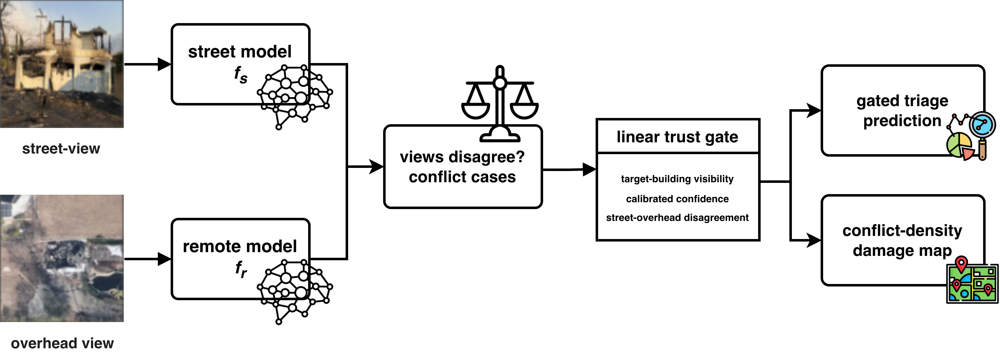

<div align="center">

# CrossViewGate

**Trust the view that sees the target: visibility-conditioned reliability gating for conflict-aware cross-view disaster damage assessment**

[](https://rayford295.github.io/CrossViewGate/)
[](paper/isprs_manuscript.md)
[-2c6fb7)](paper/geosearch2026_short/main.pdf)
[](https://github.com/rayford295/disaster-crossview-datasets)
[](LICENSE)



</div>

> **News (2026-09-23).** The short paper *Trust the View That Sees the Target: Mining
> Cross-View Conflicts for Reliability-Gated Disaster Damage Assessment* has been
> accepted as a lightning talk at the 5th ACM SIGSPATIAL International Workshop on
> Searching and Mining Large Collections of Geospatial Data (GeoSearch 2026),
> Riverside, CA, 3 November 2026.

Cross-view fusion of street-level and overhead imagery is standard in
post-disaster building damage assessment, and almost always *symmetric*: both
views are trusted equally everywhere. Measured on the cases where the two views
disagree, that assumption leaves **0.37–0.41 accuracy** on the table across
three real disasters. A **linear, interpretable gate** over building visibility,
calibrated confidence, and cross-view disagreement recovers a significant part of
it; a controlled field-of-view intervention shows the mechanism is causal; and
the disagreement signal itself, aggregated spatially, is a **label-free damage
map**.

## At a glance

| | |
| --- | --- |
| **Data** | 2025 Eaton wildfire (CAL FIRE DINS inspection photos), Hurricane Ian (CVIAN panoramas), Hurricane Milton (panoramas), each paired with VHR overhead tiles |
| **Unit of analysis** | *Conflict cases*: the 10–33% of samples where independently trained street and remote models disagree |
| **Oracle single-view gap** | 0.37–0.41 conflict accuracy, stable across five seeds, calibration, and backbones |
| **Reliability gate** | +0.072 over end-to-end fusion on wildfire conflicts and +0.018 on the full test set (p < 10⁻⁴); +0.051 over calibrated averaging (p = 0.0001); parity on panoramic data |
| **Causal test** | Building-centered 90° crops double the fusion benefit on Milton (closure 0.177 → 0.365); geometrically identical random crops do not, 6/6 |
| **Label-free map** | Tile-level conflict density predicts wildfire damage (Spearman r = 0.615, p = 0.001); single-view uncertainty anti-correlates |
| **Negative result** | Once single-view models are converged and calibrated, simple averaging matches end-to-end learned fusion; the value of learning is asymmetric, reliability-aware arbitration |

## Results

Conflict-case accuracy on the test set, five-seed means.

| Method | Eaton wildfire | Hurricane Ian | Hurricane Milton |
| --- | :---: | :---: | :---: |
| street_only | 0.486 | 0.529 | 0.557 |
| remote_only | 0.475 | 0.367 | 0.407 |
| crossview (end-to-end fusion) | 0.699 | **0.624** | **0.649** |
| calibrated probability averaging | 0.732 | 0.617 | 0.626 |
| **reliability gate (linear)** | **0.768** | 0.618 | 0.631 |
| *oracle single view* | *0.961* | *0.896* | *0.964* |
| gate closure of the oracle gap | **0.52** | 0.23 | 0.18 |

<table>
  <tr>
    <td width="50%"></td>
    <td width="50%"></td>
  </tr>
  <tr>
    <td><sub><b>Reliability gate.</b> Conflict-case accuracy by method, and the linear coefficients on the wildfire: <i>trust the street view when it is confident and the building is centered in the frame.</i></sub></td>
    <td><sub><b>Causal intervention.</b> One panorama, two 90° crops of identical geometry. Only the building-centered crop raises the cross-view conflict gain.</sub></td>
  </tr>
  <tr>
    <td></td>
    <td></td>
  </tr>
  <tr>
    <td><sub><b>Label-free damage map</b> (Eaton). Labeled damage, conflict density, their rank correlation, and the uncertainty control that anti-correlates.</sub></td>
    <td><sub><b>The oracle gap.</b> Each bar spans best single view to oracle; dots place each method inside it.</sub></td>
  </tr>
</table>

Full tables, pooled paired tests, calibration decomposition, transfer matrix,
and ordinal metrics: [`docs/results/`](docs/results/README.md). Headline numbers
come from the converged five-seed `_v2` documents.

## Papers

| Version | Where | Status |
| --- | --- | --- |
| Full manuscript | [`paper/isprs_manuscript.md`](paper/isprs_manuscript.md) | ISPRS J. Photogramm. Remote Sens. target |
| Four-page short paper | [`paper/geosearch2026_short/`](paper/geosearch2026_short/) ([PDF](paper/geosearch2026_short/main.pdf)) | Accepted (lightning talk) at GeoSearch '26, ACM SIGSPATIAL 2026 workshop; camera-ready in preparation |

Figures are in [`figures/`](figures/README.md); `python scripts/build_paper_figures.py`
regenerates them from the result CSVs.

## Repository

```text
crossview_conflict/   package: data, models, training, decision/risk control
scripts/              pipeline and analysis scripts
tests/                protocol, provenance, and integrity tests
configs/              frozen experiment contracts and ontologies
paper/                manuscripts and bibliography
figures/              publication figure set
docs/results/         result documents (_v2 = headline protocol)
docs/                 datasets.md, protocols, project website
```

| Stage | Script |
| --- | --- |
| Grouped anti-leakage splits | `make_group_splits.py`, `build_*_manifests.py`, `check_split_leakage.py` |
| Train / evaluate base models | `train_triage.py`, `eval_triage.py`, `run_multiseed_v2.sh` |
| Visibility features | `extract_visibility_features.py` |
| Calibration and reliability gate | `analyze_calibration_fusion.py`, `train_reliability_gate.py` |
| Causal FOV intervention | `build_fov_intervention.py`, `run_fov_intervention.sh`, `analyze_fov_intervention.py` |
| Conflict-density maps and statistics | `analyze_conflict_density_maps.py`, `analyze_pooled_seed_tests.py`, `analyze_ordinal_metrics.py` |

## Reproducing

```powershell
python -m venv .venv; .\.venv\Scripts\Activate.ps1; pip install -e .

bash scripts/run_multiseed_v2.sh          # 1. converged 5-seed suite (60 models)
python scripts/extract_visibility_features.py --split-csv <split>/val.csv --output-csv outputs/analysis/visibility_features/<ds>_val.csv
python scripts/analyze_calibration_fusion.py --multiseed-root outputs/multiseed_v2 --seeds 42,123,456,789,1011
python scripts/train_reliability_gate.py     --multiseed-root outputs/multiseed_v2 --seeds 42,123,456,789,1011
python scripts/analyze_pooled_seed_tests.py  --multiseed-root outputs/multiseed_v2 --seeds 42,123,456,789,1011
```

Imagery stays local; sources and split provenance are in
[`docs/datasets.md`](docs/datasets.md). Eaton is split by property and tile.
The released CVIAN split shares Mapillary sequences between train and test, so
all new spatial claims use a repaired spatial-block protocol with a 25 m buffer
([audit](docs/results/cvian_georeference_split_audit.md)); the portable
georeferenced split is published in
[`disaster-crossview-datasets`](https://github.com/rayford295/disaster-crossview-datasets/tree/main/IAN_hurricane).

## Beyond classification

A follow-up line of work asks when the available evidence is sufficient, which
view to trust, which view to acquire next, and when to defer to a human
(risk-controlled active evidence acquisition). The development results
obtained so far on the current data are transparent No-Go or sensitivity-only
findings; they are recorded in full, with their consumed-data ledger and
unlock conditions, in [`docs/results/`](docs/results/README.md) and summarised
in the
[execution status ledger](docs/results/crossviewguard_execution_status_20260710.md).

## Citation

```bibtex
@misc{yang2026crossviewgate,
  title  = {Trust the View That Sees the Target: Visibility-Conditioned Reliability
            Gating for Conflict-Aware Cross-View Disaster Damage Assessment},
  author = {Yang, Yifan},
  year   = {2026},
  note   = {https://github.com/rayford295/CrossViewGate}
}
```

Previously named `CrossViewConflict` (old URLs redirect; the package import name
stays `crossview_conflict`).
License: [Apache 2.0](LICENSE).
