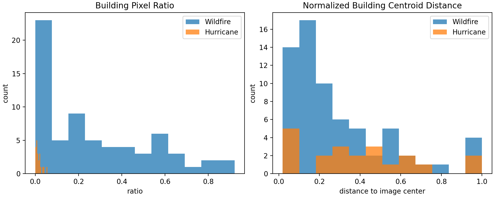

# Alignment Analysis

## Goal

We wanted to move from:

> wildfire crossview gain is larger than hurricane crossview gain

to:

> wildfire crossview gain is larger because the ground-view image is more
> tightly aligned with the target building.

## Method

We used a lightweight semantic-segmentation proxy rather than manual labeling.

- model: `nvidia/segformer-b5-finetuned-ade-640-640`
- label of interest: `building`
- subset analyzed: `conflict subset` for both datasets

For each ground-view image, we computed:

1. `building_ratio`
   fraction of pixels labeled as `building`
2. `center_building_ratio`
   fraction of `building` pixels inside the central 50% crop
3. `centroid_distance_norm`
   normalized distance from the building-pixel centroid to the image center

## Results

| Dataset | n | building ratio mean | center building ratio mean | centroid distance mean |
|---|---:|---:|---:|---:|
| Eaton wildfire conflict | 67 | 0.2684 | 0.4101 | 0.2958 |
| IAN hurricane conflict | 21 | 0.0154 | 0.0271 | 0.3965 |

## Interpretation

Three things are clear.

1. Wildfire conflict images contain far more visible building area.
2. That building area is more concentrated near the image center.
3. Hurricane conflict images are much more environment-dominant.

This supports the mechanism-level interpretation of the paper:

> Cross-view fusion helps more when the ground-view image is tightly aligned
> with the target structure, because the ground evidence is more directly
> bridgeable to the overhead image.

## Output artifacts

- tracked figure: `docs/assets/building_alignment_comparison.png`
- local summary json: `outputs/analysis/building_alignment/alignment_summary.json`
- local wildfire per-image table: `outputs/analysis/building_alignment/wildfire_conflict_alignment.csv`
- local hurricane per-image table: `outputs/analysis/building_alignment/hurricane_conflict_alignment.csv`
