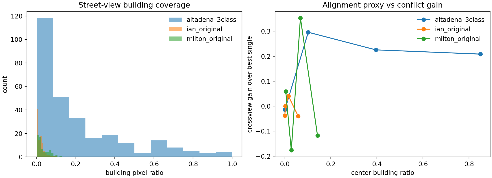

# Building Alignment Mechanism Check

This analysis uses the seed 42 conflict subsets from the main 3-class protocol and
estimates street-view building visibility with `nvidia/segformer-b0-finetuned-ade-512-512`.
The goal is not to claim perfect target-building localization, but to test whether
simple alignment proxies explain why cross-view gains differ across disasters.

| dataset | conflict n | building pixel ratio | centered building ratio | target visibility proxy | crossview - best single | visibility vs gain rho |
| --- | ---: | ---: | ---: | ---: | ---: | ---: |
| altadena_3class | 286 | 0.207 | 0.337 | 0.657 | 0.178 | 0.132, p=0.0275 |
| ian_original | 101 | 0.019 | 0.019 | 0.139 | -0.010 | 0.068, p=0.4990 |
| milton_original | 68 | 0.033 | 0.060 | 0.500 | 0.029 | 0.136, p=0.3490 |

## Interpretation

Altadena has much stronger street-view building evidence: high building pixel
ratio, high centered building ratio, and a high visibility proxy rate. It is also
the only dataset where the visibility proxy has a positive statistically
detectable relationship with conflict gain in this seed. This supports a
mechanistic explanation: cross-view learning helps most when the street view
contains a property-level building signal that can be aligned with the overhead
view.

IAN has very low building visibility in the street view, which is consistent
with its split-sensitive behavior and weaker/stabler calibration advantage for
late fusion. Milton sits between Altadena and IAN: the visibility proxy is
moderate, but the conflict subset is small, so confidence intervals remain wide.

The important paper point is that cross-view performance is not just a table
effect. It appears to depend on whether the street view actually sees the target
structure, and whether the two views provide complementary but alignable
evidence.
