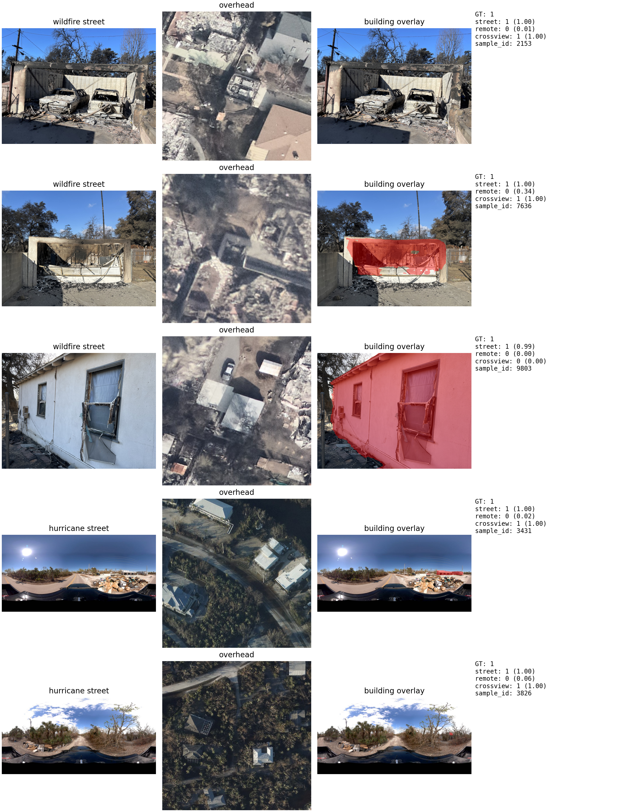

# Results Summary

## Main comparison

| Dataset | Ground-view regime | street_only F1 | remote_only F1 | crossview F1 |
|---|---|---:|---:|---:|
| Eaton wildfire | building / property-centric | 0.9604 | 0.9653 | 0.9713 |
| IAN hurricane | 360 / panoramic environment-centric | 0.8912 | 0.9082 | 0.9208 |

## Conflict subset comparison

| Dataset | Conflict rate | street_only | remote_only | crossview |
|---|---:|---:|---:|---:|
| Eaton wildfire test | 0.0338 | 0.4179 | 0.5821 | 0.7612 |
| IAN hurricane test | 0.1050 | 0.4286 | 0.5714 | 0.6190 |

## Conflict subset bootstrap intervals

| Dataset | street_only | remote_only | crossview |
|---|---|---|---|
| Eaton wildfire test | 0.4179 [0.2985, 0.5373] | 0.5821 [0.4627, 0.7015] | 0.7612 [0.6567, 0.8507] |
| IAN hurricane test | 0.4286 [0.2381, 0.6190] | 0.5714 [0.3810, 0.7619] | 0.6190 [0.4286, 0.8095] |

## Working interpretation

Three patterns are already clear.

1. Cross-view fusion is the best overall setting in both disasters.
2. The strongest gain appears on the conflict subset rather than on easy average cases.
3. The gain is larger when the ground image is tightly aligned with the target structure.

At the same time, the wildfire-vs-hurricane gap on the conflict subset should
currently be described as a supported trend rather than a hard significance
claim, because the bootstrap intervals still overlap.

This makes the paper story mechanism-oriented:

> Cross-view fusion acts primarily as a conflict resolver, and its value depends
> on how directly the ground-view image captures the target building.

## Lightweight alignment proxy

We estimated a simple target-alignment proxy on the conflict subsets using a
frozen semantic-segmentation model with a `building` class.

| Dataset | building ratio mean | center building ratio mean | centroid distance mean |
|---|---:|---:|---:|
| Eaton wildfire conflict | 0.2684 | 0.4101 | 0.2958 |
| IAN hurricane conflict | 0.0154 | 0.0271 | 0.3965 |

Interpretation:

- wildfire images contain much more visible building area
- wildfire building evidence is more centrally located
- hurricane images are far more environment-dominant

This supports the claim that cross-view gain is stronger in wildfire because
the ground-view image is more tightly aligned with the target structure.

## Permutation tests

| Dataset | crossview accuracy | label-independence p | crossview vs street p | crossview vs remote p |
|---|---:|---:|---:|---:|
| Eaton wildfire conflict | 0.7612 | < 1e-4 | 0.0147 | 0.5276 |
| IAN hurricane conflict | 0.6190 | 0.2639 | 0.7266 | 1.0000 |

Interpretation:

- wildfire conflict performance is statistically convincing
- hurricane remains directionally positive, but not yet strong enough for a hard significance claim

## Wider conflict definition (`tau = 0.1`)

We also reran the permutation analysis under a softer conflict definition,
using `|p_street - p_remote| > 0.1`.

| Dataset | n | street accuracy | remote accuracy | crossview accuracy | label-independence p |
|---|---:|---:|---:|---:|---:|
| Eaton wildfire | 435 | 0.7356 | 0.6529 | 0.7885 | < 1e-4 |
| IAN hurricane | 128 | 0.7031 | 0.7266 | 0.7500 | < 1e-4 |

Takeaway:

- under a wider notion of disagreement, `crossview` still stays strongest in
  both datasets
- the label-independence null is still decisively rejected
- this strengthens the claim that the gain is not an artifact of one
  hand-picked hard-threshold definition

## Threshold sensitivity

Crossview remains the strongest setting across softer conflict definitions.

Selected points:

| Dataset | Threshold | Conflict rate | street | remote | crossview |
|---|---:|---:|---:|---:|---:|
| Eaton wildfire | 0.1 | 0.0549 | 0.6239 | 0.7248 | 0.8349 |
| Eaton wildfire | 0.3 | 0.0393 | 0.4872 | 0.6410 | 0.7821 |
| Eaton wildfire | 0.5 | 0.0327 | 0.4154 | 0.5846 | 0.7538 |
| IAN hurricane | 0.1 | 0.1550 | 0.5806 | 0.6774 | 0.7097 |
| IAN hurricane | 0.3 | 0.1250 | 0.4800 | 0.6000 | 0.6400 |
| IAN hurricane | 0.5 | 0.1050 | 0.4286 | 0.5714 | 0.6190 |

## Per-sample alignment correlation

We tested whether the building-ratio proxy also predicts crossview success at the
single-example level on the conflict subset.

| Setting | Spearman r | p-value |
|---|---:|---:|
| wildfire building_ratio vs crossview_correct | -0.1150 | 0.3528 |
| hurricane building_ratio vs crossview_correct | 0.4212 | 0.0609 |
| combined building_ratio vs crossview_correct | 0.0708 | 0.5173 |

This does **not** currently support a strong per-sample monotonic effect.
The alignment story is therefore better framed as a `view-regime / dataset-level`
mechanism than as a within-conflict ranking signal.

## Qualitative figure

A paper-ready qualitative figure is now available:

## Backbone ablation snapshot (wildfire crossview)

We also started a backbone robustness check on the wildfire benchmark using the
same `crossview` setup and training protocol.

| Backbone | Best validation accuracy | Best validation F1 | Interpretation |
|---|---:|---:|---|
| ResNet18 | 0.9681 | 0.9676 | strong baseline |
| ResNet50 | 0.9697 | 0.9693 | confirms the main result is not a tiny-backbone artifact |
| DINOv2 ViT-S/14 | 0.9393 | 0.9378 | strong, but below the CNN baselines |
| CLIP ViT-B/32 | 0.7219 | 0.7502 | clearly underperforms in this disaster-specific triage setting |

Takeaway:

- the core `crossview` result remains strong under a larger supervised CNN
- the effect is therefore not limited to `ResNet18`
- stronger generic pretraining does **not** automatically help in this task
- the current evidence suggests that disaster triage is still sensitive to the
  backbone / pretraining regime, which is itself a useful result for the paper

## Wildfire multi-seed stability

We also completed three-seed validation runs on the wildfire benchmark.

| Mode | Seed 42 | Seed 123 | Seed 456 | Mean | Std |
|---|---:|---:|---:|---:|---:|
| crossview | 0.9676 | 0.9704 | 0.9688 | 0.9689 | 0.0011 |
| street_only | 0.9657 | 0.9658 | 0.9655 | 0.9657 | 0.0001 |
| remote_only | 0.9673 | 0.9652 | 0.9636 | 0.9654 | 0.0015 |

Takeaway:

- the wildfire `crossview` result is not only strong, but also stable across seeds
- `street_only` is very stable but consistently lower than `crossview`
- `remote_only` remains competitive, but its variance is slightly larger than `street_only`

## Hurricane backbone ablation snapshot (crossview)

The hurricane backbone-ablation sweep is now complete.

| Backbone | Best validation accuracy | Best validation F1 | Interpretation |
|---|---:|---:|---|
| ResNet18 | 0.9692 | 0.9694 | current baseline from the original hurricane run |
| ResNet50 | 0.9524 | 0.9470 | strong, but lower than the smaller baseline in this setup |
| CLIP ViT-B/32 | 0.5966 | 0.6437 | unstable and clearly not competitive in this setup |
| DINOv2 ViT-S/14 | 0.8151 | 0.7975 | better than CLIP, but still well below the CNN baselines |

This is an important reminder that a larger backbone does not automatically
improve disaster triage. On the hurricane benchmark, `ResNet50` remains
competitive, but it does not surpass the original `ResNet18` baseline.
`DINOv2` recovers some of the lost performance, but still does not match the
supervised CNNs. `CLIP` remains substantially worse and exhibits unstable
optimization on this task.

## Hurricane multi-seed stability

We also completed three-seed validation runs on the hurricane benchmark.

| Mode | Seed 42 | Seed 123 | Seed 456 | Mean | Std |
|---|---:|---:|---:|---:|---:|
| crossview | 0.9541 | 0.9390 | 0.9434 | 0.9455 | 0.0063 |
| street_only | 0.9433 | 0.9448 | 0.9419 | 0.9433 | 0.0012 |
| remote_only | 0.9021 | 0.8870 | 0.8986 | 0.8959 | 0.0065 |

Takeaway:

- hurricane `crossview` remains the best mode on average
- `street_only` is quite stable and close, but still lower
- `remote_only` is clearly weaker and more variable
- together with the wildfire multi-seed table, this gives a matched
  cross-disaster stability result for the paper

## Hurricane label-sensitivity check

We started the first robustness check against the hurricane label definition by
changing the binary task to:

- `0 = MinorDamage`
- `1 = ModerateDamage + SevereDamage`

This is a harder setting because the positive class becomes broader and more
semantically heterogeneous than the endpoint-only `Minor vs Severe` task.

Completed test results so far:

| Setting | Test accuracy | Test F1 |
|---|---:|---:|
| crossview | 0.8467 | 0.8915 |
| street_only | 0.8267 | 0.8738 |
| remote_only | 0.8400 | 0.8873 |

Current interpretation:

- the task becomes harder under the broader positive-class definition
- `crossview` still remains the best setting
- the rank order is now `crossview > remote_only > street_only`
- the margin shrinks compared with the endpoint-only `Minor vs Severe` setup,
  which is exactly the kind of robustness behavior reviewers are likely to ask about

## Wildfire alternative binary mapping

We also ran a stricter wildfire label-sensitivity experiment with:

- `0 = No Damage`
- `1 = Affected + Minor + Major + Destroyed`

Completed test results:

| Setting | Test accuracy | Test F1 |
|---|---:|---:|
| crossview | 0.9395 | 0.9473 |
| street_only | 0.9292 | 0.9392 |
| remote_only | 0.9108 | 0.9238 |

Current interpretation:

- the cross-view advantage survives this broader positive-class definition
- the rank order is `crossview > street_only > remote_only`
- this gives the paper a second robustness result on the wildfire side, not
  just the hurricane side

## Adaptive inference cascade (I4)

We also ran the first `I4 adaptive inference cascade` sweeps on the completed
label-sensitivity splits. The cascade uses:

- stage 1: average `street_only` and `remote_only` probabilities when the two
  views are close
- stage 2: call `crossview` only when the two single-view probabilities differ
  by more than a threshold

Initial findings:

- `altadena_sensitive`: the cascade can route only `9.5%` of samples to
  stage 2 and still slightly exceed the full crossview baseline (`F1 = 0.9498`
  vs `0.9473`)
- `hurricane_minor_vs_moderate_severe`: the cascade can keep stage-2 usage at
  `22.3%` and slightly improve over full crossview (`F1 = 0.8990` vs `0.8915`)

This is a promising first result because it suggests crossview fusion may be
most valuable as an adaptive conflict resolver rather than as a mandatory
always-on inference path.

## Leakage check and grouped-split status

We ran the new `objectid` leakage check proposed in the sharp-insights note.

Current status:

- `altadena_sensitive_objectid`: clean
- `ian_hurricane_minor_vs_severe`: the original split had objectid leakage
- `ian_hurricane_minor_vs_severe_grouped`: rebuilt and verified clean

This is important because it upgrades the hurricane side of the repo from
"works on a convenient split" to "has a verified objectid-clean grouped split"
for future reruns and comparisons.

## Clean grouped rerun for hurricane (`MinorDamage` vs `SevereDamage`)

After identifying leakage in the original hurricane endpoint split, we reran the
core baselines on the new clean grouped split.

| Setting | Test accuracy | Test F1 |
|---|---:|---:|
| crossview | 0.9073 | 0.9008 |
| street_only | 0.9073 | 0.9016 |
| remote_only | 0.8378 | 0.8385 |

Interpretation:

- the clean grouped split remains learnable, so the hurricane result is not
  disappearing under leakage control
- the largest effect in the clean rerun is now the strong drop in
  `remote_only`
- `crossview` and `street_only` become nearly tied on this stricter split,
  which means the clean-split paper story should emphasize
  `crossview vs remote_only` robustness and conflict resolution rather than a
  blanket "crossview always wins by a large margin" claim

## Gain decomposition and S->O correction analysis

We also ran the first gain-decomposition pass on the completed sensitivity
experiments.

For `altadena_sensitive`:

- conflict subset size: `200`
- street accuracy on conflicts: `0.5900`
- remote accuracy on conflicts: `0.4100`
- crossview accuracy on conflicts: `0.7100`
- street-corrects-overhead cases: `118 / 200 = 59.0%`
- crossview accuracy on those street-win cases: `0.7542`

For `hurricane_minor_vs_moderate_severe`:

- conflict subset size: `34`
- street accuracy on conflicts: `0.4412`
- remote accuracy on conflicts: `0.5588`
- crossview accuracy on conflicts: `0.6765`
- street-corrects-overhead cases: `15 / 34 = 44.1%`
- crossview accuracy on those street-win cases: `0.6667`

The main takeaway from this first pass is that the wildfire regime contains a
larger share of "street corrects overhead" conflict cases than the hurricane
regime, which is exactly the kind of mechanism the paper wants to isolate.

## ConflictFocalLoss pilot

We also ran the first `ConflictFocalLoss` pilot on the wildfire sensitive split.
This loss upweights samples whose street and overhead embeddings disagree more
strongly, so the model spends more capacity on conflict-like examples during
training.

| Setting | Test accuracy | Test F1 |
|---|---:|---:|
| Wildfire sensitive `crossview` baseline | 0.9395 | 0.9473 |
| `ConflictFocalLoss` (`gamma = 0.5`) | 0.9441 | 0.9520 |

Current interpretation:

- the first pilot is promising: `ConflictFocalLoss` improves over the standard
  wildfire sensitive baseline by about `+0.0047` F1
- that is not yet a full sweep, but it is already enough to justify keeping
  conflict-aware training as a real method contribution rather than a
  placeholder idea

## Label note for hurricane

The hurricane benchmark uses endpoint-to-endpoint binary classification:

- `MinorDamage -> 0`
- `SevereDamage -> 1`
- `ModerateDamage` excluded

This is intentional. The goal is to maximize label clarity and isolate the
effect of ground-view regime, rather than optimize for a broader but noisier
binary collapse.
