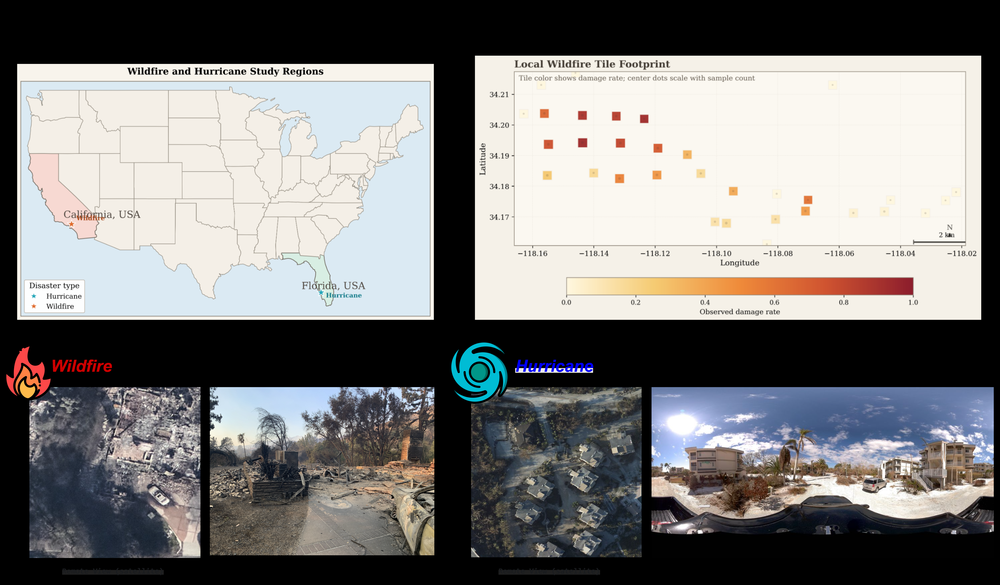

# When Cross-View Helps Most: Conflict-Aware Disaster Triage Across Spatial Observation Regimes

## Abstract

Cross-view disaster assessment is usually evaluated by average classification
accuracy, even though the practical value of paired ground and overhead imagery
appears most clearly when the two views disagree. We study this problem through
a conflict-centered lens on two paired disaster datasets with different spatial
observation regimes: an Eaton/Altadena wildfire dataset contributed by this
paper, built from property-centric inspection imagery and overhead patches, and
a Hurricane Ian benchmark reused from prior cross-view work, built from
panoramic ground imagery and overhead patches. We introduce a Conflict-Aware
Evaluation Protocol (CAE) that reports overall F1, conflict-subset F1 under a
soft disagreement threshold, and the gain of cross-view fusion over the best
single-view model. CAE reveals a regime-dependent pattern we call view
dominance switching. In wildfire conflicts, the street-view model is the
stronger single-view arbitrator; in broader hurricane settings, the overhead
model becomes stronger. Cross-view fusion remains best in both regimes because
it can exploit whichever single view is more informative. We further show that
tile-level cross-view conflict density forms an unsupervised spatial damage
signal in the wildfire dataset (`Spearman r = 0.512`, `p = 0.0063`), and that a
conflict-aware training objective improves wildfire cross-view F1 from `0.9473`
to `0.9520` while improving Conflict-F1 from `0.6618` to `0.7208`. Together,
these results recast cross-view disaster assessment from
average-case multimodal classification to conflict-aware, regime-aware spatial
reasoning.

## 1. Introduction

Post-disaster building assessment increasingly relies on multiple visual
modalities. Overhead imagery provides broad geographic coverage and stable
spatial context, while ground-level imagery reveals facade condition,
street-facing damage, and local structural cues. Cross-view models are intended
to combine these complementary signals. In practice, however, most cross-view
studies ask only whether multimodal fusion improves average performance. That
question is incomplete.

The more consequential question is when cross-view fusion actually matters. In
real deployments, many samples are easy. A heavily damaged building may be
obvious in both views, while an intact building may be equally clear from both
street and overhead imagery. Cross-view fusion becomes most valuable when the
two modalities provide competing evidence. Those disagreement cases are the
settings in which a deployment team would most want an additional source of
information or a more reliable fusion policy.

This paper studies cross-view disaster triage from that perspective. We argue
that cross-view value is fundamentally conflict-dependent and regime-dependent.
It is conflict-dependent because the practical value of fusion is concentrated
in cases where single-view models disagree. It is regime-dependent because the
relative usefulness of ground and overhead evidence changes with the spatial
observation regime of the ground-view imagery. A property-centric inspection
photo and a panoramic environmental photo are both "ground-view" images, but
they encode very different relationships to the target building.

We investigate this hypothesis on two paired disaster datasets. The first is an
Eaton/Altadena wildfire dataset built from property-centric inspection imagery
paired with overhead patches. The second is a Hurricane Ian benchmark built
from panoramic ground imagery paired with overhead patches. These datasets do
not merely differ by disaster type. More importantly, they differ by spatial
observation regime: the wildfire ground view is usually tightly aligned with the
target property, whereas the hurricane ground view often contains broader
environmental context and weaker target alignment.

To study these settings, we introduce a Conflict-Aware Evaluation Protocol
(CAE). CAE reports: (1) standard overall F1 on the full test set, (2)
Conflict-F1 on the subset of samples where the single-view models disagree
under a soft probability-gap threshold, and (3) the conflict gain of cross-view
fusion over the best single-view baseline. This protocol changes the paper's
evaluation axis from average-case performance to conflict resolution.

Using CAE, we find that cross-view fusion is consistently strongest on
disagreement cases, but the dominant single view changes across regimes. In the
wildfire setting, the ground-view model is stronger than the overhead model on
conflict cases. In broader hurricane settings, the overhead model becomes the
stronger single-view arbitrator. Cross-view fusion remains useful in both
regimes because it can exploit whichever modality is more informative. We refer
to this phenomenon as view dominance switching.

We then show that the conflict-centered framing also leads to two useful method
extensions. First, a tile-level conflict density map, computed from the
disagreement magnitude between street-only and remote-only predictors, becomes a
significant unsupervised spatial damage indicator in the wildfire dataset.
Second, a conflict-aware training objective, ConflictFocalLoss, improves
wildfire cross-view performance across multiple weighting settings, with the
best run increasing test F1 from 0.9473 to 0.9520.

This paper makes four primary contributions:

1. We introduce a Conflict-Aware Evaluation Protocol for paired-view disaster
   triage, shifting evaluation from average-case F1 to conflict-centered
   reasoning.
2. We show that cross-view gain is regime-dependent: the dominant single-view
   arbitrator changes across building-centric and panoramic observation regimes.
3. We demonstrate that tile-level cross-view conflict density forms an
   unsupervised spatial damage map in the wildfire setting.
4. We show that conflict can be operationalized beyond evaluation:
   ConflictFocalLoss improves the hardest wildfire conflict cases, and an
   adaptive cascade preserves or improves full cross-view performance while
   routing only a minority of samples to paired-view inference.

The broader implication is that cross-view disaster intelligence should not be
modeled as generic multimodal fusion. It should be understood as conflict-aware,
regime-aware spatial reasoning.

*Figure 1. Overview of the study design and spatial observation regimes. The top row provides geographic context through the U.S. study-region locator map and the local wildfire tile footprint used for tile-level analysis. The bottom row contrasts paired remote and ground views for the wildfire and hurricane settings, illustrating the property-centric wildfire regime and the panoramic hurricane regime considered throughout the paper.*

## 2. Related Work

Research on post-disaster visual assessment has largely focused on single-view
remote sensing benchmarks, especially satellite-only settings. This literature
has established strong baselines for damage classification and mapping, but it
does not address how different visual viewpoints interact when they disagree.

A smaller body of work studies ground-view imagery for disaster assessment.
These approaches often use street-level or inspection imagery to recover local
structural evidence that overhead imagery cannot directly observe. However,
ground-only models face their own limitations: narrow viewpoint, occlusion,
non-uniform coverage, and dependence on how well the captured scene aligns with
the target structure.

Recent cross-view disaster work begins to bridge these modalities by pairing
ground and overhead imagery. The closest prior direction uses Hurricane Ian
ground imagery with overhead imagery for cross-view disaster perception. That
line of work demonstrates that paired-view learning is feasible and useful, but
it still evaluates mainly by aggregate classification performance. It does not
separate easy cases from disagreement cases, and it does not ask whether the
dominant evidence source changes across spatial observation regimes.

More broadly, multimodal fusion in vision and geospatial learning often assumes
that the modalities should be fused symmetrically. In disaster settings, that
assumption is fragile. A property-centric inspection image and a panoramic
environmental image carry different target alignment, different spatial context,
and different failure modes. Our work is closer in spirit to GeoAI studies that
ask how spatial observation processes shape model behavior, rather than merely
which architecture gives the highest average score.

This paper differs from prior cross-view disaster work in three ways. First, it
defines the conflict subset as the primary evaluation target. Second, it uses a
cross-disaster design to compare two observation regimes rather than simply two
datasets. Third, it translates disagreement analysis into spatial and algorithmic
outputs: a conflict-density map, a conflict-aware training loss, and an
adaptive conflict-resolver perspective on cross-view inference.

## 3. Problem Setting and Datasets

### 3.1 Task

We study binary disaster triage from paired images. Each example contains a
ground-view image and a paired overhead patch, with a binary damage label. The
goal is to predict whether the target building belongs to the positive or
negative damage class under a specified split definition.

We consider three model settings under a shared training protocol:

- `street_only`: ground image only
- `remote_only`: overhead image only
- `crossview`: paired ground + overhead fusion

### 3.2 Eaton/Altadena Wildfire Dataset

Our wildfire dataset pairs property-centric inspection imagery with overhead
patches. The ground images are typically taken from close range and are visually
anchored to the target property. This gives the dataset strong target alignment
and makes it a natural setting to study whether local facade evidence helps
resolve conflicts in overhead interpretation.

For the primary wildfire binary triage task, we use:

- `0 = No Damage + Affected`
- `1 = Minor + Major + Destroyed`

We also evaluate a stricter sensitivity split:

- `0 = No Damage`
- `1 = Affected + Minor + Major + Destroyed`

The wildfire dataset additionally contains reliable spatial grouping metadata,
which allows tile-level geographic analysis and map-based outputs.

### 3.3 Hurricane Ian Benchmark

The hurricane benchmark pairs panoramic ground imagery with overhead patches.
Unlike the wildfire dataset, the ground view here is not tightly centered on a
single property. It often includes broader street context, neighboring
structures, and environmental clutter. We therefore treat it as a panoramic or
environment-centric observation regime.

For the endpoint binary setting, we use:

- `0 = MinorDamage`
- `1 = SevereDamage`

We also evaluate a broader sensitivity setting:

- `0 = MinorDamage`
- `1 = ModerateDamage + SevereDamage`

The original hurricane endpoint split showed object-level leakage. We therefore
rebuilt a clean grouped split and use it as the more reliable hurricane control
condition.

### 3.4 Why This Comparison Matters

These datasets give us more than a two-disaster benchmark. They instantiate two
different spatial observation regimes:

- `building-centric / property-centric`
- `panoramic / environment-centric`

This regime distinction is central to our paper. We do not assume cross-view
fusion is equally valuable in all paired-view settings. Instead, we test
whether its gain depends on how directly the ground-view image captures the
target structure.

## 4. Conflict-Aware Evaluation Protocol

Average test F1 is necessary but insufficient. To isolate the value of cross-
view fusion in the cases that matter most, we define a Conflict-Aware Evaluation
Protocol (CAE).

For each completed setting, CAE reports:

1. `Overall-F1`: standard F1 over the full test set.
2. `Conflict-F1`: F1 over the disagreement subset defined by
   `|p_street - p_remote| > tau`.
3. `Delta_view`: the gain of cross-view fusion over the better single-view
   model on the conflict subset.

In our main experiments, we use `tau = 0.1`. This soft conflict definition is
more robust than a hard binary disagreement test and yields usable conflict-set
sizes for both datasets. Under this definition, the conflict subset contains
435 wildfire samples and 128 hurricane sensitivity samples, both with
permutation-test significance below `1e-4`.

Conceptually, CAE reframes the task. Instead of asking whether multimodal
fusion improves average classification, CAE asks whether fusion helps when the
single-view models disagree and which modality drives that improvement.

## 5. Method

### 5.1 Base Triage Architecture

We use a unified late-fusion architecture across all experiments. The
`street_only` and `remote_only` models each use a single encoder followed by a
binary classification head. The `crossview` model uses one encoder per view and
builds a late-fusion representation from:

- the street embedding
- the overhead embedding
- their absolute difference
- their elementwise product

This architecture is intentionally simple. Our goal is not to maximize raw
architectural novelty, but to create a controlled setting in which we can study
when and why paired-view fusion helps.

### 5.2 View Dominance Switching

Given CAE, we analyze conflict cases by asking which single-view model is more
accurate within that subset. We also decompose conflicts into directional
correction types:

- `S→O`: street is correct, overhead is wrong
- `O→S`: overhead is correct, street is wrong
- `both wrong`
- `both correct` under the soft disagreement threshold

This decomposition provides a mechanism-level explanation of cross-view gain.
If one view more frequently corrects the other in a given regime, the fusion
model should derive more of its conflict-resolution value from that modality.

### 5.3 ConflictFocalLoss

We introduce ConflictFocalLoss as a conflict-aware training objective for
cross-view triage. The intuition is simple: disagreement-heavy samples are
rarer than agreement cases, but they are also more important to the paper's
central problem. Standard binary loss treats every example equally. In
contrast, ConflictFocalLoss increases the effective weight of samples whose
street and overhead embeddings disagree more strongly.

We evaluate a gamma sweep over:

- `0.1`
- `0.25`
- `0.5`
- `1.0`

The purpose of this sweep is not just to find a good point estimate, but to
test whether conflict-aware weighting provides a stable positive signal across a
range of strengths.

### 5.4 Adaptive Inference Cascade

We also study an adaptive two-stage cascade. Stage 1 uses the street-only and
remote-only models. If their probabilities are close, we use their average as
the prediction. If their disagreement exceeds a threshold, we route the sample
to the full cross-view model as Stage 2.

This design operationalizes our core claim: cross-view fusion is most useful as
an on-demand conflict resolver, rather than an always-on inference path.

### 5.5 Conflict Density Spatial Map

For the wildfire dataset, we convert paired-view disagreement into a tile-level
spatial signal. For each geographic tile `t`, we compute:

`conflict_density(t) = mean_i |p_street_i - p_remote_i|`

over all samples in the tile. This produces an unsupervised conflict-density
map. If conflict density correlates with observed damage rate, then cross-view
disagreement itself becomes a useful GIS-native spatial damage proxy.

## 6. Experimental Setup

We train all three base modes under a unified protocol and compare them across
datasets, sensitivity settings, and backbone variants. The primary experiments
use ResNet18 encoders. We also evaluate ResNet50, DINOv2 ViT-S/14, and CLIP
ViT-B/32 in the cross-view setting to assess backbone dependence.

To evaluate robustness, we run:

- multi-seed experiments on wildfire and hurricane
- label-sensitivity experiments on both datasets
- a clean grouped rerun on hurricane
- threshold-sensitivity and permutation tests on the conflict subset

For statistical checks, we use:

- bootstrap confidence intervals on conflict subsets
- label-independence permutation tests
- Spearman correlation for tile-level conflict-density mapping

For mechanism analysis, we use a frozen semantic segmentation model to estimate
building occupancy and centrality in the ground-view imagery, which serves as a
lightweight target-alignment proxy.

## 7. Results

### Table 1. Unified Summary of Main Results

Table 1 is the paper's primary summary table. It collects the most important
evaluation settings under a single conflict-aware frame, so a reviewer can see
the overall result, the disagreement-subset result, and the regime effect in
one place.

| Method | Dataset | Split | Overall-F1 | Conflict-F1 (`tau=0.1`) | `Delta_view` | Notes |
| --- | --- | --- | ---: | ---: | ---: | --- |
| street_only | Wildfire | endpoint | 0.9604 | — | — | main benchmark |
| remote_only | Wildfire | endpoint | 0.9653 | — | — | main benchmark |
| crossview | Wildfire | endpoint | 0.9713 | — | — | main benchmark |
| voting ensemble | Wildfire | sensitive | 0.9396 | — | — | probability average |
| street_only | Wildfire | sensitive | 0.9392 | 0.6230 | — | CAE split |
| remote_only | Wildfire | sensitive | 0.9238 | 0.5237 | — | CAE split |
| crossview | Wildfire | sensitive | 0.9473 | 0.6618 | +0.0388 | CAE split |
| crossview + ConflictFocalLoss (`gamma = 0.5`) | Wildfire | sensitive | 0.9520 | 0.7208 | — | best CFL run |
| street_only | Hurricane | endpoint | 0.9055 | 0.6842 | — | CAE split |
| remote_only | Hurricane | endpoint | 0.8969 | 0.5806 | — | CAE split |
| crossview | Hurricane | endpoint | 0.9192 | 0.7647 | +0.0805 | CAE split |
| voting ensemble | Hurricane | endpoint | 0.9100 | — | — | probability average |
| street_only | Hurricane | moderate+severe | 0.8738 | 0.7324 | — | broader positive class |
| remote_only | Hurricane | moderate+severe | 0.8873 | 0.7742 | — | broader positive class |
| crossview | Hurricane | moderate+severe | 0.8915 | 0.7867 | +0.0125 | broader positive class |
| voting ensemble | Hurricane | moderate+severe | 0.8936 | — | — | probability average |
| street_only | Hurricane | grouped clean | 0.9016 | 0.8101 | — | objectid-clean rerun |
| remote_only | Hurricane | grouped clean | 0.8385 | 0.6526 | — | objectid-clean rerun |
| crossview | Hurricane | grouped clean | 0.9008 | 0.7949 | -0.0153 | objectid-clean rerun |
| voting ensemble | Hurricane | grouped clean | 0.8800 | — | — | probability average |

Two patterns from Table 1 matter most. First, the practical value of
cross-view fusion is concentrated in conflict cases rather than in easy average
cases. Second, the sign and magnitude of `Delta_view` are regime- and
split-dependent, which is why the paper's main claim is about when cross-view
helps, not about unconditional dominance on every benchmark.

### 7.1 Main Results

Across the original benchmark settings, cross-view fusion achieves the best
overall test F1 in both disasters:

- wildfire: `street_only = 0.9604`, `remote_only = 0.9653`,
  `crossview = 0.9713`
- hurricane: `street_only = 0.8912`, `remote_only = 0.9082`,
  `crossview = 0.9208`

These numbers confirm that paired-view fusion is useful on average. However,
the main value of the paper lies in what happens on conflict cases.

### 7.2 Conflict-Aware Evaluation Protocol

CAE shows that the strongest gains indeed concentrate on the disagreement
subset. On the wildfire sensitive setting, the conflict-set F1 values are:

- `street_only = 0.6230`
- `remote_only = 0.5237`
- `crossview = 0.6618`
- `Delta_view = +0.0388`

On hurricane endpoint:

- `street_only = 0.6842`
- `remote_only = 0.5806`
- `crossview = 0.7647`
- `Delta_view = +0.0805`

On hurricane moderate+severe sensitivity:

- `street_only = 0.7324`
- `remote_only = 0.7742`
- `crossview = 0.7867`
- `Delta_view = +0.0125`

On the clean grouped hurricane split:

- `street_only = 0.8101`
- `remote_only = 0.6526`
- `crossview = 0.7949`
- `Delta_view = -0.0153`

This is an important corrective result. The clean grouped split shows that
cross-view is not universally dominant across all hurricane conditions.
However, the protocol still makes the disagreement structure visible. Without
CAE, this nuanced picture would be hidden by a single overall score.

### 7.3 View Dominance Switching

Under the broader wildfire sensitivity setting and the broader hurricane
sensitivity setting, the rank order of single-view models flips on conflict
cases:

- wildfire: `crossview > street > remote`
- hurricane: `crossview > remote > street`

This is the sharpest mechanism finding in the paper. It shows that the
dominant single-view evidence source changes with the observation regime.

Directional correction analysis supports this interpretation. Under the
`tau = 0.1` CAE definition, wildfire sensitivity conflicts contain a larger
share of street-correct / overhead-wrong cases (`S->O = 0.2713`) than
overhead-correct / street-wrong cases (`O->S = 0.1885`). The hurricane endpoint
split is much closer to balanced (`S->O = 0.3750`, `O->S = 0.3438`), while the
broader hurricane moderate+severe split shifts toward overhead dominance
(`S->O = 0.1094`, `O->S = 0.1328`). This is consistent with the regime
interpretation: the property-centric wildfire ground view more often captures
decisive structure-level evidence, whereas the panoramic hurricane ground view
is more weakly aligned to the target building.

### 7.4 Alignment Proxy

The segmentation-based alignment proxy reinforces this argument. On the conflict
subset:

- wildfire mean building ratio: `0.2684`
- hurricane mean building ratio: `0.0154`
- wildfire center building ratio: `0.4101`
- hurricane center building ratio: `0.0271`

Wildfire ground images contain far more visible building content, and that
content is more centrally located. Hurricane ground images are much more
environment-dominant. This is exactly the regime distinction the paper seeks to
formalize.

### 7.5 Threshold Sensitivity and Permutation Tests

The conflict-centered story remains stable under a soft threshold definition.
At `tau = 0.1`:

- wildfire conflict-set size: `435`
- hurricane conflict-set size: `128`
- both permutation tests: `p < 1e-4`

Accuracy on the `tau = 0.1` conflict subset is:

- wildfire: `street = 0.7356`, `remote = 0.6529`, `crossview = 0.7885`
- hurricane: `street = 0.7031`, `remote = 0.7266`, `crossview = 0.7500`

This confirms that the disagreement-centered effect is not an artifact of a
single hard-threshold definition.

### 7.6 Backbone Sensitivity

The backbone results show that larger or more generic pretraining is not
automatically better for cross-view disaster triage.

Wildfire cross-view best validation F1:

- ResNet18: `0.9676`
- ResNet50: `0.9693`
- DINOv2: `0.9378`
- CLIP: `0.7502`

Hurricane cross-view best validation F1:

- ResNet18: `0.9694`
- ResNet50: `0.9470`
- DINOv2: `0.7975`
- CLIP: `0.6437`

These results strengthen the paper in two ways. First, the cross-view pattern
is not a tiny-backbone artifact. Second, general vision-language pretraining
does not transfer cleanly to this disaster triage problem.

### 7.7 Multi-Seed Robustness

Wildfire multi-seed mean ± std:

- `crossview = 0.9689 ± 0.0011`
- `street_only = 0.9657 ± 0.0001`
- `remote_only = 0.9654 ± 0.0015`

Hurricane multi-seed mean ± std:

- `crossview = 0.9455 ± 0.0063`
- `street_only = 0.9433 ± 0.0012`
- `remote_only = 0.8959 ± 0.0065`

The main pattern is stable across seeds. This is especially useful for the
wildfire result, where cross-view remains consistently stronger than both
single-view modes.

### 7.8 Label Sensitivity

The broader hurricane binary mapping remains cross-view favorable:

- `crossview = 0.8915`
- `street_only = 0.8738`
- `remote_only = 0.8873`

The broader wildfire binary mapping also preserves the ordering:

- `crossview = 0.9473`
- `street_only = 0.9392`
- `remote_only = 0.9238`

These sensitivity checks are important because they show that the cross-view
story is not limited to one exact label collapse.

### 7.9 Clean Hurricane Grouped Split

After fixing object-level leakage in the hurricane endpoint split, we reran the
core baselines on a clean grouped split:

- `crossview = 0.9008`
- `street_only = 0.9016`
- `remote_only = 0.8385`

This is one of the most important sanity checks in the paper. It prevents
overclaiming. The clean split shows that the hurricane result is not "crossview
always dominates." Instead, the defensible claim is that cross-view remains
useful as a conflict-aware comparator and clearly outperforms remote-only on the
clean split, while its advantage over street-only can shrink depending on the
task definition and split rigor.

### 7.10 ConflictFocalLoss

The complete ConflictFocalLoss sweep on wildfire sensitivity yields:

| Setting | Overall-F1 | Conflict-F1 (`tau=0.1`) | Delta Conflict-F1 |
|---|---:|---:|---:|
| crossview baseline | 0.9473 | 0.6618 | -- |
| `gamma = 0.1` | 0.9514 | 0.6906 | +0.0289 |
| `gamma = 0.25` | 0.9507 | 0.7190 | +0.0572 |
| `gamma = 0.5` | 0.9520 | 0.7208 | +0.0590 |
| `gamma = 1.0` | 0.9470 | 0.6957 | +0.0339 |

This is a useful method result. Moderate conflict-aware weighting is
consistently beneficial, while overly strong weighting collapses back toward
baseline-level performance. The best setting, `gamma = 0.5`, improves the
wildfire sensitivity task by `+0.0047` overall F1, but the more important
effect is the `+0.0590` Conflict-F1 gain on the disagreement subset.

### 7.11 Adaptive Cascade

The adaptive cascade also supports the paper's central idea.

- wildfire sensitive: route only `9.5%` of samples to Stage 2, achieve
  `F1 = 0.9498`, slightly above full cross-view `0.9473`
- hurricane moderate+severe: route `22.3%` of samples to Stage 2, achieve
  `F1 = 0.8990`, above full cross-view `0.8915`

These results suggest that cross-view fusion is often most valuable as a
selective conflict resolver rather than a mandatory always-on model.

### 7.12 Conflict Density Spatial Map

On the wildfire dataset, tile-level conflict density forms a significant
unsupervised damage proxy:

- `n_tiles = 27`
- `Spearman r = 0.512`
- `p = 0.0063`

This is a strong GeoAI result because it converts disagreement between two
discriminative models into a spatial damage map without using tile-level labels
at inference time.

## 8. Discussion

The results support a different way of thinking about cross-view fusion in
disaster intelligence. The main value of fusion is not simply that it adds more
information and nudges up average F1. Its more important function is to resolve
evidence conflict. That is why conflict-centered evaluation is more revealing
than average-case evaluation alone.

The hurricane story is especially important to state clearly. On the clean
grouped split, `crossview` and `street_only` are nearly tied overall
(`0.9008` vs `0.9016`), which is a conservative boundary condition rather than
a failure. At the same time, the broader hurricane conflict analyses remain
significant under `tau = 0.1`, and the single-view ranking can shift toward
remote dominance on the broader sensitivity setting. This is exactly what the
paper's theory predicts: in a panoramic regime where ground-view evidence is
less tightly aligned to the target structure, the average advantage of
cross-view fusion can shrink, while its conflict-resolution role remains
meaningful and increasingly dependent on overhead evidence.

The paper also suggests that "ground-view" is too coarse a category. A
property-centric inspection image and a panoramic environmental view interact
with overhead imagery in different ways. This is why the paper uses the concept
of spatial observation regime. In one regime, the ground view offers strong
target-specific corrections. In another, the overhead image can remain the more
trustworthy single-view source.

This regime-centered explanation is especially relevant for GeoAI. The central
question is not just how to combine modalities, but how the spatial alignment
between the observer and the target changes the utility of each modality.

## 9. Limitations

This paper has several limitations.

First, the spatial map contribution currently holds strongly for the wildfire
dataset but not for hurricane, because the external hurricane benchmark lacks
reliable tile-level spatial metadata and coordinates. We therefore treat
wildfire as the primary GIS-native spatial analysis dataset and hurricane as a
cross-regime comparison benchmark.

Second, the clean grouped hurricane split leads to a more conservative result
than the original endpoint split. This leakage-controlled split is a necessary
boundary condition for the study: the paper should emphasize conflict-aware
value and regime comparison rather than a blanket assertion that cross-view
always dominates every baseline.

Third, ConflictFocalLoss is currently validated only on the wildfire sensitive
setting. The positive signal is encouraging, but broader validation remains
future work.

## 10. Conclusion

This paper argues that cross-view disaster triage should be understood as
conflict-aware, regime-aware spatial reasoning. Across wildfire and hurricane
paired-view datasets, cross-view fusion is most useful on disagreement cases,
not merely on average cases. The dominant single-view arbitrator changes across
spatial observation regimes, yielding a view dominance switching effect that is
mechanistically explained by target alignment and directional correction rates.
We further show that conflict can be elevated from an analysis artifact to a
method and spatial signal: it supports conflict-aware training, adaptive
cross-view inference, and unsupervised tile-level damage mapping.

The broader takeaway is that multimodal disaster assessment should not ask only
whether fusion helps. It should ask when fusion helps, which modality drives the
gain, and what spatial regime makes that gain possible.

## Figures to Finalize for Submission

1. **View Dominance Switching figure**
   - wildfire vs hurricane conflict bars
   - highlight the single-view rank-order flip
2. **CAE summary figure or table**
   - Overall-F1, Conflict-F1, and Delta_view across all main settings
3. **Wildfire spatial maps**
   - observed damage rate
   - conflict density
   - cross-view gain
   - optional dominance-by-tile panel
4. **ConflictFocalLoss sweep figure**
   - gamma vs overall F1
   - gamma vs conflict F1

## Citation and Formatting Notes

- This draft is intentionally written as a content-complete conference paper
  draft before final bibliography cleanup.
- The next pass should add finalized citations for satellite-only disaster
  benchmarks, cross-view hurricane baselines, and the GeoAI/GIS evaluation
  context.
- After citation cleanup, this draft can be converted to ACM SIGSPATIAL LaTeX
  format with only minor structural edits.
sensitivity split does not imply that every hurricane split is strictly
overhead-dominant. On the clean grouped hurricane endpoint split, the conflict
decomposition is closer to balanced than to strongly remote-dominant. The
stable statement is therefore weaker and more honest: wildfire is clearly
street-dominant, while hurricane is regime-sensitive and can move toward remote
dominance when the task definition broadens and the panoramic context becomes
more influential.
